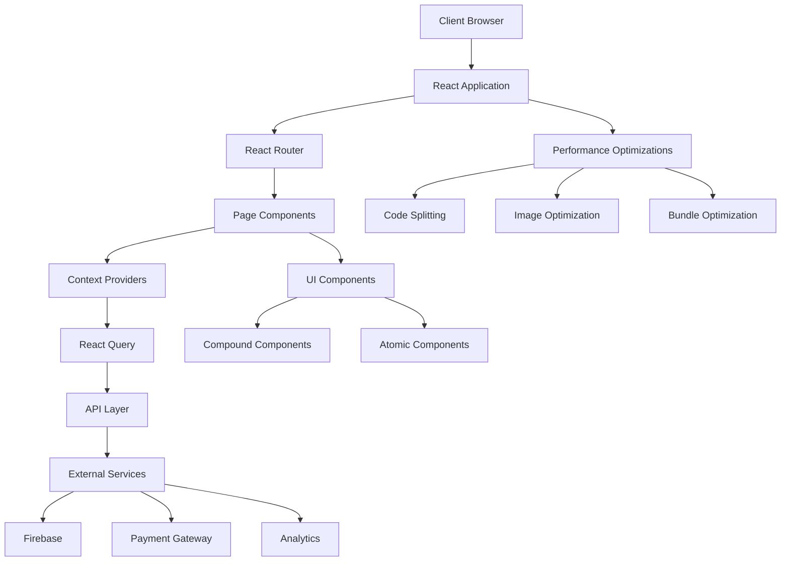

# Design Document: Codebase Improvements

## Overview

This design document outlines the comprehensive approach to improving the Kumar Prescod boxing website codebase. The improvements are structured around key areas including performance optimization, type safety, component architecture, state management, accessibility, SEO, testing, and documentation. The goal is to create a more maintainable, performant, and user-friendly website while establishing best practices for ongoing development.

## Architecture

### Current Architecture

The Kumar Prescod boxing website currently uses the following architecture:

- **Frontend Framework**: React 18 with TypeScript
- **Styling**: Tailwind CSS
- **Routing**: React Router v6
- **State Management**: React Context API
- **Animation**: Framer Motion
- **Data Fetching**: Mixed approaches (fetch API, axios)
- **Authentication**: Firebase
- **Analytics**: Google Analytics 4, Facebook Pixel

The application follows a component-based architecture with the following structure:

```
src/
├── components/       # Reusable UI components
├── content/          # Static content and data
├── contexts/         # React Context providers
├── hooks/            # Custom React hooks
├── pages/            # Page components
├── utils/            # Utility functions
├── App.tsx           # Main application component
└── index.tsx         # Application entry point
```

### Proposed Architecture Enhancements

While maintaining the core architecture, we will enhance it with the following improvements:

1. **Standardized Data Fetching**: Implement React Query for consistent data fetching, caching, and state management
2. **Enhanced Type System**: Strengthen TypeScript usage with stricter typing and better interfaces
3. **Component Architecture**: Implement compound component patterns for complex UI elements
4. **Performance Optimization**: Add code splitting, lazy loading, and image optimization
5. **Testing Infrastructure**: Add comprehensive testing with Jest, React Testing Library, and Cypress
6. **Accessibility Layer**: Enhance components with proper ARIA attributes and keyboard navigation
7. **SEO Enhancements**: Add structured data and improved meta tags
8. **Build Process**: Implement CI/CD pipeline with automated testing and deployment

### Architecture Diagram



## Components and Interfaces

### Enhanced Component Structure

We will implement a more structured component architecture with the following patterns:

1. **Atomic Design Methodology**:
   - Atoms: Basic UI elements (buttons, inputs, icons)
   - Molecules: Simple component combinations
   - Organisms: Complex UI sections
   - Templates: Page layouts
   - Pages: Full page components

2. **Component Folder Structure**:
```
components/
├── ComponentName/
│   ├── index.ts             # Main export
│   ├── ComponentName.tsx    # Component implementation
│   ├── ComponentName.test.tsx # Component tests
│   ├── ComponentName.types.ts # Component types
│   └── subcomponents/       # Related subcomponents
```

3. **Compound Component Pattern** for complex UI elements:
```typescript
// Example of compound component pattern
const Gallery = ({ children, ...props }) => {
  const [state, dispatch] = useReducer(galleryReducer, initialState);
  
  return (
    <GalleryContext.Provider value={{ state, dispatch }}>
      <div className="gallery" {...props}>
        {children}
      </div>
    </GalleryContext.Provider>
  );
};

Gallery.Item = GalleryItem;
Gallery.Controls = GalleryControls;
Gallery.Lightbox = GalleryLightbox;

// Usage
<Gallery>
  <Gallery.Controls />
  <Gallery.Item src="image1.jpg" />
  <Gallery.Item src="image2.jpg" />
  <Gallery.Lightbox />
</Gallery>
```

### Enhanced Type Definitions

We will strengthen the type system with the following improvements:

1. **Strict Type Definitions**:
```typescript
// Before
interface PhotoProps {
  src: string;
  alt?: string;
  onClick?: any;
}

// After
interface PhotoProps {
  src: string;
  alt: string;
  width?: number;
  height?: number;
  onClick?: (event: React.MouseEvent<HTMLImageElement>) => void;
}
```

2. **API Type Definitions**:
```typescript
// API response types
export interface ApiResponse<T> {
  data: T;
  meta: {
    status: number;
    message: string;
    pagination?: {
      page: number;
      pageSize: number;
      total: number;
      totalPages: number;
    };
  };
}

export interface FightData {
  id: string;
  opponent: {
    name: string;
    record: string;
  };
  date: string;
  venue: string;
  result?: 'win' | 'loss' | 'draw' | 'no_contest';
  method?: string;
  round?: number;
}

export type FightsResponse = ApiResponse<FightData[]>;
```

3. **Discriminated Unions** for complex state:
```typescript
type LoadingState = {
  status: 'loading';
};

type SuccessState<T> = {
  status: 'success';
  data: T;
};

type ErrorState = {
  status: 'error';
  error: Error;
};

type DataState<T> = LoadingState | SuccessState<T> | ErrorState;

// Usage
function renderData<T>(state: DataState<T>) {
  switch (state.status) {
    case 'loading':
      return <LoadingSpinner />;
    case 'success':
      return <DataDisplay data={state.data} />;
    case 'error':
      return <ErrorMessage error={state.error} />;
  }
}
```

## Data Models

### Enhanced Data Models

We will implement more robust data models with proper typing:

1. **Core Data Models**:
```typescript
// User model
export interface User {
  id: string;
  email: string;
  name: string;
  role: UserRole;
  avatar?: string;
  joinDate: string;
  lastLogin?: string;
  preferences: UserPreferences;
  membershipTier?: MembershipTier;
  volunteerSkills?: string[];
  donationHistory?: Donation[];
}

export type UserRole = 'admin' | 'member' | 'volunteer' | 'guest';
export type MembershipTier = 'basic' | 'premium' | 'vip';

export interface UserPreferences {
  notifications: boolean;
  newsletter: boolean;
  eventUpdates: boolean;
  darkMode?: boolean;
}

export interface Donation {
  id: string;
  amount: number;
  date: string;
  goalId: string;
  anonymous: boolean;
}
```

2. **Content Models**:
```typescript
// Fight model
export interface Fight {
  id: string;
  title: string;
  date: string;
  time: string;
  location: string;
  venue: string;
  opponent: Opponent;
  ticketInfo: TicketInfo;
  result?: FightResult;
  media?: Media[];
  highlights?: string[];
}

export interface Opponent {
  id: string;
  name: string;
  record: string;
  nickname?: string;
  image?: string;
}

export interface TicketInfo {
  onSaleDate: string;
  priceRange: {
    min: number;
    max: number;
  };
  purchaseUrl: string;
  vipPackages: boolean;
}

export type FightResult = {
  outcome: 'win' | 'loss' | 'draw' | 'no_contest';
  method: string;
  round?: number;
  time?: string;
  highlights?: string[];
};
```

3. **Media Models**:
```typescript
export interface Media {
  id: string;
  type: 'image' | 'video' | 'audio';
  url: string;
  title: string;
  description?: string;
  date: string;
  tags: string[];
  category: MediaCategory;
  featured?: boolean;
  memberOnly?: boolean;
}

export type MediaCategory = 
  | 'training' 
  | 'fight' 
  | 'portrait' 
  | 'community' 
  | 'podcast' 
  | 'interview';
```

## Error Handling

### Enhanced Error Handling Strategy

We will implement a comprehensive error handling strategy:

1. **API Error Handling**:
```typescript
// API error handling
export class ApiError extends Error {
  status: number;
  code: string;
  
  constructor(message: string, status: number, code: string) {
    super(message);
    this.name = 'ApiError';
    this.status = status;
    this.code = code;
  }
}

// API client with error handling
const apiClient = axios.create({
  baseURL: '/api',
  headers: {
    'Content-Type': 'application/json'
  }
});

apiClient.interceptors.response.use(
  response => response,
  error => {
    if (error.response) {
      const { status, data } = error.response;
      throw new ApiError(
        data.message || 'An error occurred',
        status,
        data.code || 'UNKNOWN_ERROR'
      );
    }
    throw new ApiError('Network error', 0, 'NETWORK_ERROR');
  }
);
```

2. **Error Boundaries**:
```typescript
// Error boundary component
export class ErrorBoundary extends React.Component<
  { fallback: React.ReactNode; children: React.ReactNode },
  { hasError: boolean; error: Error | null }
> {
  constructor(props) {
    super(props);
    this.state = { hasError: false, error: null };
  }

  static getDerivedStateFromError(error) {
    return { hasError: true, error };
  }

  componentDidCatch(error, errorInfo) {
    // Log error to monitoring service
    console.error('Error caught by boundary:', error, errorInfo);
  }

  render() {
    if (this.state.hasError) {
      return this.props.fallback;
    }

    return this.props.children;
  }
}

// Usage
<ErrorBoundary fallback={<ErrorPage />}>
  <MyComponent />
</ErrorBoundary>
```

3. **Form Validation**:
```typescript
// Form validation with Zod
import { z } from 'zod';

const contactFormSchema = z.object({
  name: z.string().min(2, 'Name must be at least 2 characters'),
  email: z.string().email('Invalid email address'),
  message: z.string().min(10, 'Message must be at least 10 characters')
});

type ContactFormData = z.infer<typeof contactFormSchema>;

// Usage in form submission
const handleSubmit = (data: unknown) => {
  try {
    const validatedData = contactFormSchema.parse(data);
    // Process form with validated data
  } catch (error) {
    if (error instanceof z.ZodError) {
      // Handle validation errors
      const formattedErrors = error.errors.reduce((acc, curr) => {
        const path = curr.path.join('.');
        acc[path] = curr.message;
        return acc;
      }, {});
      setErrors(formattedErrors);
    }
  }
};
```

## Testing Strategy

### Comprehensive Testing Approach

We will implement a multi-layered testing strategy:

1. **Unit Testing**:
```typescript
// Example unit test for utility function
import { formatCurrency } from '../utils/formatters';

describe('formatCurrency', () => {
  it('formats USD correctly', () => {
    expect(formatCurrency(1000, 'USD')).toBe('$1,000.00');
  });
  
  it('handles zero values', () => {
    expect(formatCurrency(0, 'USD')).toBe('$0.00');
  });
  
  it('handles negative values', () => {
    expect(formatCurrency(-500, 'USD')).toBe('-$500.00');
  });
});
```

2. **Component Testing**:
```typescript
// Example component test
import { render, screen, fireEvent } from '@testing-library/react';
import Button from '../components/Button';

describe('Button component', () => {
  it('renders correctly', () => {
    render(<Button>Click me</Button>);
    expect(screen.getByRole('button')).toHaveTextContent('Click me');
  });
  
  it('calls onClick handler when clicked', () => {
    const handleClick = jest.fn();
    render(<Button onClick={handleClick}>Click me</Button>);
    fireEvent.click(screen.getByRole('button'));
    expect(handleClick).toHaveBeenCalledTimes(1);
  });
  
  it('applies variant styles correctly', () => {
    render(<Button variant="primary">Primary</Button>);
    expect(screen.getByRole('button')).toHaveClass('bg-primary-600');
  });
});
```

3. **Integration Testing**:
```typescript
// Example integration test
import { render, screen, waitFor } from '@testing-library/react';
import { QueryClient, QueryClientProvider } from 'react-query';
import FightsList from '../components/FightsList';
import { rest } from 'msw';
import { setupServer } from 'msw/node';

const server = setupServer(
  rest.get('/api/fights', (req, res, ctx) => {
    return res(
      ctx.json({
        data: [
          {
            id: '1',
            title: 'Championship Fight',
            date: '2023-12-15'
          }
        ]
      })
    );
  })
);

beforeAll(() => server.listen());
afterEach(() => server.resetHandlers());
afterAll(() => server.close());

test('loads and displays fights', async () => {
  const queryClient = new QueryClient();
  
  render(
    <QueryClientProvider client={queryClient}>
      <FightsList />
    </QueryClientProvider>
  );
  
  expect(screen.getByText('Loading fights...')).toBeInTheDocument();
  
  await waitFor(() => {
    expect(screen.getByText('Championship Fight')).toBeInTheDocument();
  });
});
```

4. **E2E Testing**:
```typescript
// Example Cypress E2E test
describe('Ticket purchase flow', () => {
  beforeEach(() => {
    cy.visit('/fights');
  });
  
  it('allows users to purchase tickets', () => {
    // Find and click on a fight
    cy.contains('Championship Fight').click();
    
    // Click on buy tickets button
    cy.contains('button', 'Buy Tickets').click();
    
    // Select ticket type
    cy.get('[data-testid="ticket-type-vip"]').click();
    
    // Enter quantity
    cy.get('[data-testid="ticket-quantity"]').clear().type('2');
    
    // Proceed to checkout
    cy.contains('button', 'Proceed to Checkout').click();
    
    // Fill in customer information
    cy.get('[name="name"]').type('John Doe');
    cy.get('[name="email"]').type('john@example.com');
    
    // Complete purchase
    cy.contains('button', 'Complete Purchase').click();
    
    // Verify success message
    cy.contains('Purchase Successful').should('be.visible');
  });
});
```

## Security Considerations

### Enhanced Security Measures

We will implement the following security enhancements:

1. **Authentication Security**:
   - Implement proper token management
   - Add CSRF protection
   - Implement secure password policies
   - Add multi-factor authentication support

2. **Data Protection**:
   - Sanitize user inputs
   - Implement proper data validation
   - Use HTTPS for all communications
   - Implement proper access controls

3. **Dependency Security**:
   - Regular security audits of dependencies
   - Automated vulnerability scanning
   - Dependency update strategy

4. **Frontend Security Best Practices**:
   - Implement Content Security Policy
   - Add proper CORS configuration
   - Protect against XSS attacks
   - Implement secure cookie handling

## User Experience Design

### Enhanced User Experience

We will implement the following UX improvements:

1. **Performance Optimizations**:
   - Implement progressive image loading
   - Add skeleton loading states
   - Optimize animations for performance
   - Implement code splitting for faster initial load

2. **Accessibility Enhancements**:
   - Add proper focus management
   - Implement ARIA attributes
   - Ensure keyboard navigation
   - Add screen reader support

3. **Responsive Design Improvements**:
   - Enhance mobile layouts
   - Implement touch-friendly interactions
   - Add device-specific optimizations
   - Improve form factor adaptability

4. **Error Handling UX**:
   - Create user-friendly error messages
   - Add inline form validation
   - Implement graceful error recovery
   - Add offline support

## Integration Points

### Enhanced Integration Strategy

We will improve integration with external systems:

1. **Analytics Integration**:
   - Standardize event tracking
   - Implement enhanced ecommerce tracking
   - Add conversion tracking
   - Implement custom dimensions and metrics

2. **Payment Processing**:
   - Enhance Stripe integration
   - Add Apple Pay and Google Pay support
   - Implement better error handling
   - Add payment analytics

3. **Social Media Integration**:
   - Enhance sharing capabilities
   - Improve social media embeds
   - Add rich preview support
   - Implement social login options

4. **Content Management**:
   - Add structured content models
   - Implement content versioning
   - Add content scheduling
   - Enhance media management

## Performance Considerations

### Performance Optimization Strategy

We will implement the following performance improvements:

1. **Image Optimization**:
   - Implement responsive images
   - Add WebP and AVIF format support
   - Implement lazy loading
   - Add image compression pipeline

2. **JavaScript Optimization**:
   - Implement code splitting
   - Add tree shaking
   - Optimize bundle size
   - Implement module federation

3. **CSS Optimization**:
   - Implement CSS purging
   - Add critical CSS extraction
   - Optimize animation performance
   - Implement CSS code splitting

4. **Caching Strategy**:
   - Implement browser caching
   - Add service worker caching
   - Implement API response caching
   - Add state persistence

## Accessibility

### Comprehensive Accessibility Approach

We will implement the following accessibility improvements:

1. **Semantic HTML**:
   - Use proper heading hierarchy
   - Implement landmark regions
   - Add descriptive link text
   - Use appropriate HTML elements

2. **ARIA Implementation**:
   - Add ARIA roles
   - Implement ARIA states and properties
   - Add accessible labels
   - Implement live regions

3. **Keyboard Navigation**:
   - Ensure proper tab order
   - Add focus management
   - Implement keyboard shortcuts
   - Add skip links

4. **Screen Reader Support**:
   - Add alt text for images
   - Implement ARIA descriptions
   - Add context for interactive elements
   - Ensure proper announcements

## Internationalization

While not an immediate requirement, we will prepare the codebase for future internationalization:

1. **Text Externalization**:
   - Extract UI strings
   - Implement i18n framework
   - Add language selection
   - Support RTL languages

2. **Localization Support**:
   - Add date and time formatting
   - Implement number formatting
   - Add currency handling
   - Support pluralization

## Implementation Considerations

### Implementation Strategy

We will implement these improvements using the following approach:

1. **Incremental Adoption**:
   - Start with high-impact, low-risk improvements
   - Implement changes in isolation when possible
   - Use feature flags for gradual rollout
   - Maintain backward compatibility

2. **Code Quality Assurance**:
   - Implement linting and formatting
   - Add pre-commit hooks
   - Implement code reviews
   - Add automated testing

3. **Documentation**:
   - Create component documentation
   - Add architecture documentation
   - Implement code comments
   - Create usage examples

4. **Developer Experience**:
   - Improve build tooling
   - Add development utilities
   - Implement debugging tools
   - Create developer documentation